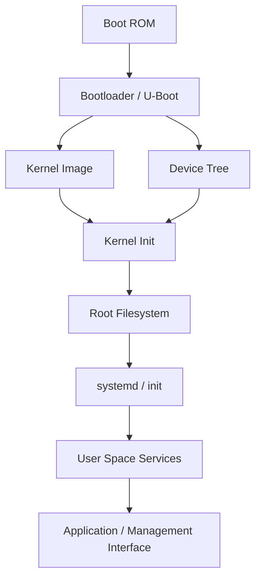

# Linux Internals Overview

## 一句話總結

這一章談的不是獨立於 Linux Internals 之外的「Linux 架構學」，而是先建立後面 process、thread、system call、memory、I/O 與 debugging 會一直用到的整體地圖。

## 為什麼重要

這一章的角色比較像 Linux Internals 的入口章，而不是另一條平行主線。

先把系統分層、責任邊界、boot path 與常見元件位置對齊，後面再看 User Space vs Kernel Space、Process、System Call、Memory Management 時，才不會變成一堆彼此分離的名詞。

對 Firmware Engineer / Embedded Linux Engineer 來說，Linux 架構不是背景知識，而是每天在 debug 時真正會拿來用的地圖。

如果沒有這張地圖，很容易發生幾件事：

- 看到功能壞掉，只會說「程式有問題」，卻不知道是 app、service、kernel、driver 還是硬體路徑出了事
- 看到 timeout，只會重跑 command，卻不知道是 IPC 卡住、system call 沒回、driver block，還是 bus transaction 根本沒完成
- 看到 boot 異常，只會看最後一行 error，卻不知道該從 bootloader、device tree、kernel init 還是 root filesystem 開始切

Linux 之所以要設計成現在這個樣子，本質上是在解決幾個很現實的工程問題：

1. 不同應用與 service 需要共享同一台機器，但不能互相踩壞
2. 不同硬體平台需要跑同一套上層軟體，但不能讓每個應用都自己管理硬體細節
3. 系統需要同時支援多工、權限控制、driver、filesystem、network 與 IPC
4. 當問題發生時，工程師要能夠有系統地定位故障層級，而不是靠猜

如果 Linux 沒有這套架構，而是讓每個應用程式直接碰硬體、直接管理記憶體、直接決定 CPU 使用權，那實際結果會是：

- process 之間無法安全共存
- driver 與 app 邏輯混在一起，幾乎無法維護
- 同一份程式很難移植到不同 SoC / board
- 系統異常會變成整機級 chaos，而不是可以分層定位的 bug

對面試也很重要。  
很多 Linux 面試題表面上在問：

- 什麼是 kernel？
- user space 與 kernel space 差在哪？
- driver 為什麼通常在 kernel？
- bootloader、kernel、rootfs 各自做什麼？

本質上其實都在確認你有沒有「系統觀」，而不只是會背 API 名稱。

## 核心觀念

### 0. 先看關鍵名詞

如果你是第一次整理 Linux internals，下面這些名詞先抓到「它大概在系統裡做什麼」就夠了，不用一開始就把所有細節背起來。

| 名詞 | 先怎麼理解 | 在系統裡做什麼 | 你通常在哪裡看到它 |
| --- | --- | --- | --- |
| Bootloader | kernel 啟動前的前導程式 | 載入 kernel、Device Tree、設定 boot 參數 | `U-Boot`、serial boot log |
| Kernel | Linux 的核心 | 管 CPU、memory、driver、filesystem、network | `dmesg`、kernel log |
| Driver | kernel 跟硬體之間的轉接層 | 把硬體能力接到 Linux 架構裡 | I2C/SPI/GPIO/hwmon driver |
| Root filesystem (`rootfs`) | user space 的基本檔案世界 | 提供 binary、library、config、init system | `/bin`、`/sbin`、`/etc`、`/usr` |
| init system | 系統進入 user space 後的第一個管理者 | 啟動與管理 service | `systemd` |
| daemon / service | 長時間背景執行的程式 | 提供產品功能或系統功能 | `systemd` unit、`phosphor-*`、`bmcweb` |
| VFS | `Virtual File System` | 統一不同 filesystem 的操作介面 | `open()`、`read()`、ext4、sysfs、procfs |
| Device Tree | 板級硬體描述資料 | 告訴 kernel 板子上有哪些 device 與資源 | `.dts`、`.dtb`、driver probe |
| sysfs | kernel 暴露資訊到 user space 的一種檔案介面 | 讓你用「像讀檔案」的方式看裝置資訊 | `/sys` |
| procfs | kernel / process 狀態介面 | 暴露 process 與系統狀態 | `/proc` |
| system call | user space 進 kernel 的合法入口 | 讓程式安全地使用 kernel 服務 | `open()`、`read()`、`mmap()` |
| IPC | `Inter-Process Communication` | 不同 process 之間交換資料 | pipe、socket、message queue、D-Bus |
| kernel module | 可動態載入的 kernel 元件 | 讓 driver / 功能不一定要全部 built-in | `lsmod`、`modprobe` |

如果只看第一章，我建議先這樣記：

- Bootloader：把 kernel 啟起來
- Kernel：把整台機器管起來
- Driver：讓 kernel 知道怎麼用硬體
- Rootfs：讓 user space 有東西可以跑
- systemd：把 service 管起來
- VFS：把不同檔案系統包成同一種用法
- Device Tree：告訴 kernel 板子上到底接了什麼硬體

### 1. Linux 不只是一個 kernel，而是一整套執行架構

很多人一開始會把 Linux 等同於 kernel，但從實務上看，Firmware Engineer 看到的「Linux 系統」通常至少包含：

- Boot ROM / Bootloader
- Linux kernel
- Device driver
- Root filesystem
- init system，例如 `systemd`
- user space service / daemon
- application / management interface

也就是說，面對一個 BMC 或 Embedded Linux 系統時，你實際在 debug 的不是單一 binary，而是一條從 boot 到 runtime 的系統鏈。

### 2. Kernel 是中央資源仲裁者，不是單純的函式庫

Linux kernel 的角色不是「提供一些 API」，而是整台機器的資源管理者。它負責：

- CPU scheduling
- memory management
- interrupt / exception handling
- device driver model
- VFS（`Virtual File System`，統一檔案系統抽象層）
- network stack
- IPC 基礎機制
- security / permission boundary

這種設計解決的問題是：  
讓所有 process 能共享同一套硬體，但不需要彼此信任，也不需要自己直接控制硬體。

如果 kernel 不當這個仲裁者，會變成：

- 每個程式都要自己管 CPU / memory / I/O
- 任一個 bug 都可能直接破壞別的 component
- 上層軟體幾乎不可能用一致方式操作不同硬體

### 3. Linux 是 monolithic kernel，但不是全部寫死

這是 Linux 架構面試很常問的點。

Linux 通常被歸類為 monolithic kernel，意思是：

- scheduler、memory manager、VFS、network stack、很多 driver 都在 kernel space
- 它們可以直接在核心內互相呼叫，不需要像 microkernel 那樣大量透過 message passing 繞來繞去

但 Linux 又不是完全 rigid，因為它同時支援：

- loadable kernel modules
- 動態 driver probe
- 可以 built-in，也可以做成 module 的 driver

這種設計反映的是 trade-off：

- monolithic：效能較好、核心內 subsystem 互動直接
- module 化：維持彈性、可配置性、可重用性

對 Embedded Linux / OpenBMC 來說，這個選擇很實際：

- 有些關鍵 driver 必須 built-in，因為 boot 過程早期就要用
- 有些非必要功能可做成 module，降低 image 複雜度

### 4. 上層負責 policy，kernel 提供 mechanism

這是理解 Linux 架構很重要的一條線。

kernel 主要提供的是通用機制，例如：

- process / thread scheduling
- memory mapping
- socket
- file abstraction
- device access path

但很多「系統行為策略」不應該硬寫死在 kernel，例如：

- service 失敗後要不要 restart
- 哪些 daemon 先啟動
- 哪些 sensor 值要暴露給 Redfish
- 產品層的錯誤處理與狀態機

這些多半留在 user space。

這樣設計的好處是：

- kernel 保持通用
- 產品邏輯不會污染底層
- 上層 service 可以獨立演進

如果沒有這種分工，常見結果會是：

- kernel 塞滿產品特定邏輯
- user space 又不得不碰很多底層細節
- 一旦需求改變，整套東西都難改

### 5. 架構的價值，在於統一 interface

Linux 架構並不是要隱藏所有硬體細節，而是讓上層對下層的存取方式盡量一致。

常見的 interface 包含：

- system call
- `/dev/*`
- sysfs
- procfs
- socket
- pipe
- signal

這解決的問題是：

- 上層程式不需要知道每個裝置的私有控制流程
- debug 時可以沿著固定 interface 追
- 新 driver / service 可以接到既有架構，而不是每次自創一套使用方式

例如在 OpenBMC 上：

- sensor service 不需要自己直接打 I2C register
- 多半透過 sysfs、hwmon 或裝置節點與 kernel driver 互動
- `bmcweb` 再透過 D-Bus 跟這些 service 互動

這種 layered interface 才是系統能維護的原因。

### 6. 對 Embedded Linux 而言，boot path 本身就是架構的一部分

桌面 Linux 學習者有時會把重點放在 process / filesystem / network；但對 firmware 工程師來說，boot path 一開始就是核心問題。

一條典型路徑大致如下：

這條路徑每一層都在解決不同問題：

- Boot ROM：把控制權交給可更新的 boot code
- Bootloader：載入 kernel、device tree、initramfs / rootfs 相關資訊
- Kernel：初始化核心 subsystem，建立可執行環境
- Root filesystem：提供 user space binary、library、config
- init / `systemd`：建立 runtime service graph

如果這些角色沒有切開，後果通常是：

- 平台耦合度太高
- 更新困難
- 失敗時幾乎不知道是哪層壞掉

### 7. Device Tree 是 Embedded Linux 架構裡的關鍵橋樑

在很多 ARM / BMC 平台上，kernel 並不知道板子上實際焊了哪些 device、掛在哪條 bus、用哪個 IRQ、哪些 pinmux 設定。

這時候 Device Tree 解決的問題是：

- 把 board-level hardware description 從 kernel code 分離
- 同一個 kernel 可以支援多個 board variant
- driver 根據 `compatible`、address、interrupt、clock 等資訊完成 binding

如果沒有這層：

- 每個 board variant 都得改 kernel code
- driver 與 board description 綁死
- bring-up 與維護成本都會很高

這是很多 firmware 問題的根源之一。  
你看到「driver 沒有 probe」時，並不代表 driver 一定壞掉，也可能是：

- DTS / DTB 沒帶到
- `compatible` 不對
- bus 沒起來
- clock / reset / pinctrl 前置條件不滿足

### 8. Linux 架構最終是拿來做 debug 的

真的有工程價值的理解，不是把 subsystem 名字全部背起來，而是遇到問題時能快速問對問題：

- 問題發生在 boot 階段，還是 runtime？
- 是 user space service 沒起來，還是 kernel path 根本沒準備好？
- 是 interface 走不通，還是 lower layer 已經壞掉？
- 是機制本身有問題，還是 policy / configuration 出錯？

下面這張表是我認為最實用的架構視角：

| 層級 | 主要責任 | 常見元件 | 常見異常 | 第一個該看的東西 |
| --- | --- | --- | --- | --- |
| Boot | 載入 kernel / DT / rootfs | Boot ROM、U-Boot | 無法進 kernel、boot 卡死 | serial log、bootargs、image/DTB |
| Kernel Core | 建立核心執行環境 | scheduler、MM、VFS、net | panic、oops、hang | `dmesg`、kernel log |
| Driver | 連接硬體與 kernel API | I2C/SPI/GPIO/hwmon driver | probe fail、timeout、IRQ 異常 | driver log、sysfs、bus 狀態 |
| User Space Base | 啟動與管理 service | `systemd`、udev | service 沒起來、dependency fail | `systemctl`、`journalctl` |
| Product Service | 實作產品邏輯 | `bmcweb`、phosphor-* | timeout、D-Bus error、功能缺失 | service log、D-Bus 狀態 |
| Hardware | 真正產生資料與事件 | sensor、flash、NIC、BMC peripheral | bus error、讀值異常、無回應 | scope / register / bus trace |

## 實務案例

### 案例 1：OpenBMC 上看不到 sensor，問題不一定在 web service

表面現象可能是：

- Redfish API 查不到 sensor
- Web UI 顯示 N/A
- `busctl` 查某個 property timeout

如果沒有架構觀，很容易直接懷疑 `bmcweb`。  
但用 Linux 架構切下去，會知道應該先看整條路徑：

實際 debug 可以這樣切：

1. `bmcweb` 有沒有活著？
2. D-Bus object 在不在？
3. sysfs 節點在不在？
4. `dmesg` 有沒有 driver probe fail 或 I2C timeout？
5. bus transaction 是否真的有發出去？

這個例子最關鍵的收穫不是知道某個 command，而是知道：

- 問題是沿著架構路徑傳遞的
- 上層錯誤不代表上層就是根因
- 你要找的是「哪一層先失真」

### 案例 2：kernel 起來了，但某個裝置永遠沒有被建立

常見現象：

- `/dev` 裡沒有期待的 node
- 對應 sysfs 不存在
- user space service 啟動後直接報找不到裝置

這種情況很多人會先改 service，但實際上常見根因在更前面：

- device tree 沒描述這個硬體
- `compatible` mismatch，driver 沒 binding
- clock / reset / pinctrl 沒處理
- driver built 成 module，但 rootfs / auto-load 配置不完整

如果你懂 Linux 架構，就會知道這是「driver / hardware description / boot integration」問題，不是一般 application bug。

### 案例 3：一個 user space timeout，可能根本不是 user space 邏輯錯

假設某個 daemon 呼叫 `read()` 或 `poll()` 一直等不到結果。

常見直覺是：

- thread 卡住了
- event loop 寫錯了

但從架構角度看，還有很多可能：

- kernel driver 沒送 event
- IRQ 沒進來
- wait queue 沒被喚醒
- 下層 bus timeout 導致整條 path 被 block

所以對 firmware 工程師來說，「Linux 架構」不是抽象理論，而是決定你第一刀要切在哪裡。

## 常見面試題

### 1. 你怎麼描述 Linux architecture？

我會避免只回答「user space 跟 kernel space」。  
比較完整的說法是：

- Linux 是以 kernel 為中心的分層架構
- kernel 負責硬體抽象、資源管理與權限邊界
- user space service / application 建立產品邏輯
- bootloader、device tree、rootfs、init system 在 Embedded Linux 裡同樣是架構的一部分

### 2. Linux kernel 的核心責任是什麼？

至少要能講出：

- scheduling
- memory management
- interrupt / exception handling
- driver model
- filesystem / VFS
- network stack
- IPC / security boundary

面試官通常不是要你列單字，而是想知道你理解 kernel 為什麼是「仲裁者」。

### 3. 為什麼 Linux 要做成這種分層？

建議回答方向：

- 讓上層軟體不必直接碰硬體
- 讓不同 process 可以共享資源但不互相破壞
- 讓不同平台可以重用同一套上層軟體
- 出問題時可以分層定位

### 4. Linux 是 monolithic kernel 還是 microkernel？

Linux 通常被歸類為 monolithic kernel。  
但更好的回答是補一句：

- 它雖然是 monolithic，但支援 loadable modules，因此在實務上保有一定程度的彈性

如果能進一步講出：

- 為何這樣對 driver performance 與 subsystem interaction 有利
- 為什麼 Embedded Linux 常同時使用 built-in driver 與 module

會更有深度。

### 5. 在 Embedded Linux 中，bootloader、kernel、rootfs 各自做什麼？

建議回答：

- bootloader：載入 kernel 與 DT / initramfs，設定 boot 參數
- kernel：初始化核心 subsystem 與 driver，建立執行環境
- rootfs：提供 user space binary、library、config 與 init system

這題常被用來判斷你有沒有做過 bring-up 或平台 debug。

### 6. Device Tree 在 Linux architecture 裡扮演什麼角色？

建議回答：

- 它把 board-specific hardware description 從 kernel code 拆開
- 讓同一個 kernel 可以支援多種 board / SoC 組合
- driver 可根據 DT 內容完成 probe 與資源取得

### 7. 遇到功能異常時，怎麼利用 Linux 架構來 debug？

這題很值得答得有工程感。

我會這樣回答：

1. 先判斷問題是在 boot 還是 runtime
2. 再判斷是 user space、kernel、driver 還是 hardware path
3. 沿著 request path 往下找第一個失真的層
4. 用對應層級的工具蒐證，而不是所有 log 一起看

### 8. OpenBMC 跟 Linux architecture 的關係是什麼？

可回答：

- OpenBMC 是建立在 Embedded Linux 上的 BMC software stack
- 它大量依賴 Linux kernel、device driver、systemd、D-Bus、filesystem 與 network stack
- 很多 OpenBMC 問題表面上是 service 問題，實際上常跨到 driver / hardware path

## 我的筆記

- 我不該把 Linux architecture 當成「很多名詞的集合」，而應該把它看成「一條 request 怎麼穿越系統」的地圖
- 對 firmware 工程師來說，最重要的不是把所有 subsystem 細節一次學完，而是先知道每層在系統裡負責什麼
- 當我遇到 bug 時，先切層，再看 log，通常比先看一堆 log 再猜更有效
- 如果我能說清楚 bootloader、kernel、driver、user space service 各自的責任邊界，很多面試題就不會只剩背答案

我目前對這章最重要的提醒是：

1. 先學會畫出路徑
2. 再學會判斷哪層擁有狀態
3. 最後才是深入單一 subsystem 細節

## 延伸閱讀

- `man 7 bootup`
- `man 2 intro`
- Linux kernel source: `Documentation/admin-guide/`
- Linux kernel source: `Documentation/devicetree/`
- Linux kernel source: `Documentation/driver-api/`
- `The Linux Programming Interface`
- `Linux Device Drivers`
- OpenBMC 官方文件  
  重點不是先背元件名，而是對照 Linux 架構去理解 OpenBMC service 為什麼這樣分層
