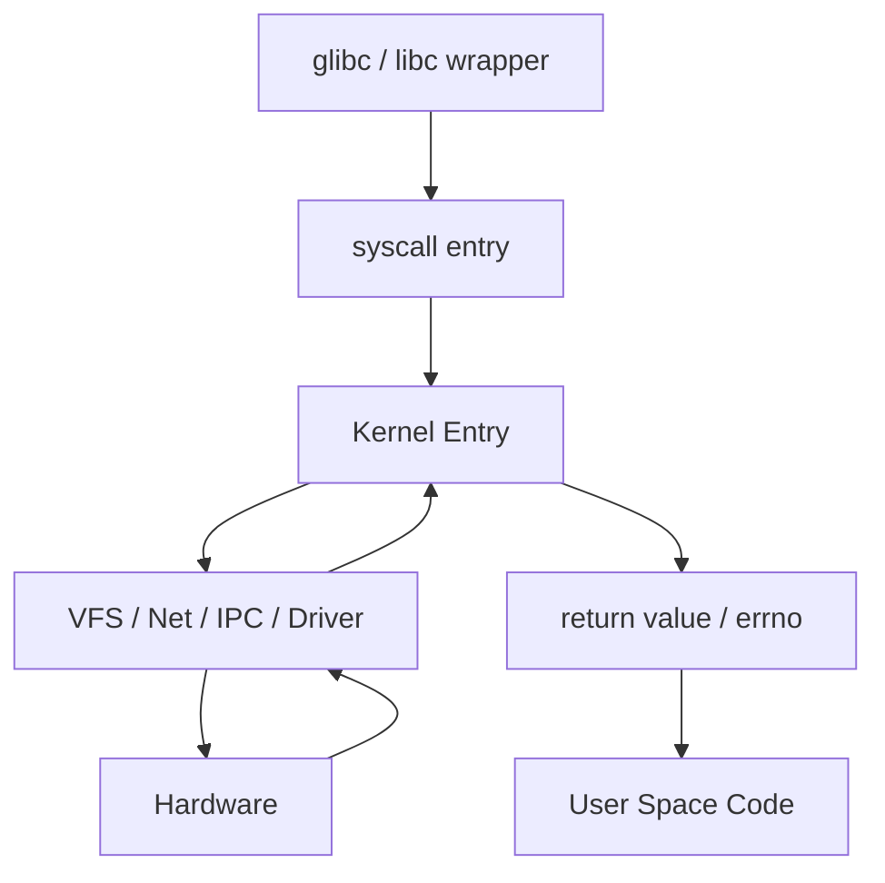
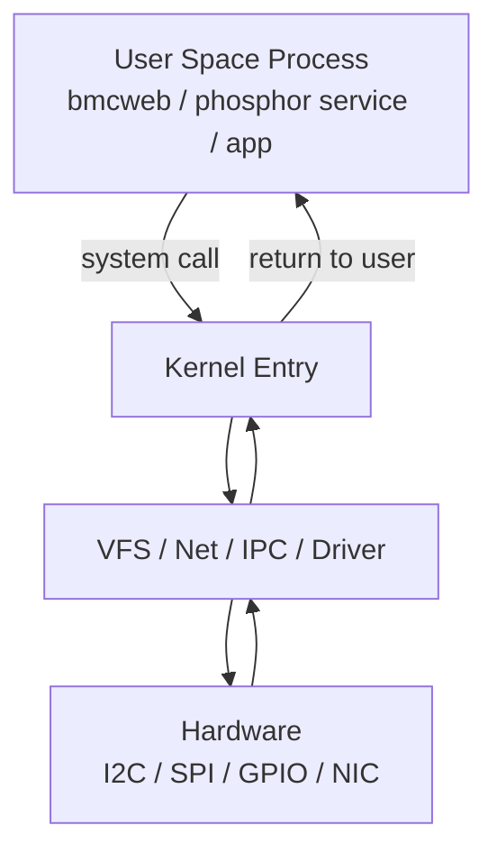
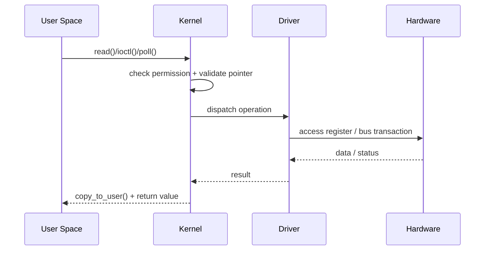

# User Space vs Kernel Space

## 一句話總結

User Space 與 Kernel Space 的核心不是「誰比較底層」，而是 Linux 用來隔離權限、保護系統穩定性、管理硬體存取邊界的基本設計。

### Note Metadata

| Item | Value |
| --- | --- |
| Category | Linux Internals |
| Difficulty | Beginner |
| Importance | ⭐⭐⭐⭐⭐ |
| Interview Frequency | ⭐⭐⭐⭐⭐ |
| Last Updated | 2026-06-10 |

## 為什麼重要

對 Firmware Engineer / Embedded Linux Engineer 來說，這不是教科書名詞，而是每天都會碰到的除錯邏輯。

如果第一章是在建立整張 Linux Internals 地圖，這一章就是先把圖上最重要的一條邊界畫清楚：哪些事情應該留在 User Space，哪些能力必須由 Kernel 代管。

- 當一個 process crash 時，為什麼通常只死它自己，不會整台機器一起掛掉？
- 為什麼 user space 程式不能直接碰 MMIO register？
- 為什麼 `open()`、`read()`、`ioctl()` 看起來像一般 function call，實際上卻能控制硬體？
- 為什麼有些 bug 會看到 `Segmentation fault`，有些則是整機卡死、watchdog reset、kernel panic？

Linux 把 User Space 與 Kernel Space 分開，解決的是三個非常實際的問題：

1. 權限控制  
   不是所有程式都該直接操作硬體、page table、中斷控制器、scheduler。
2. 故障隔離  
   一個 user process 寫壞記憶體，不應該直接破壞整個系統。
3. 穩定的硬體抽象  
   應用程式用 system call 與 driver 溝通，不需要每個程式都自己管理裝置細節。

如果沒有這層機制，Embedded Linux 系統很快就會變成：

- 任一個 daemon 都能直接覆蓋別人的記憶體
- 任一個 bug 都可能把 kernel data structure 打壞
- 任一個 service 都可能直接亂改 IRQ / MMIO / DMA 狀態
- debug 變成「整台機器為什麼莫名其妙壞掉」，而不是「是哪個 process 出問題」

這也是面試常問的原因。面試官不是要你背定義，而是想確認你是否理解：

- Linux 為什麼需要 privilege boundary
- 系統呼叫如何跨越 boundary
- user crash 跟 kernel crash 的本質差異
- 這些知識如何幫助你定位真實的 firmware 問題

## 核心觀念

### 1. User Space 是受限制的執行環境

User Space 內跑的是一般應用程式與 daemon，例如：

- OpenBMC 的 `bmcweb`
- `systemd`
- sensor 相關 service
- 自己寫的 monitoring tool

這些程式可以：

- 配置自己的 virtual memory
- 開啟檔案
- 建立 thread
- 透過 socket、pipe、D-Bus 溝通

但它們不能直接：

- 關中斷
- 修改 page table
- 直接執行 privileged instruction
- 任意讀寫 kernel memory
- 任意存取裝置寄存器

這種限制不是為了麻煩開發者，而是為了讓「大多數 bug」停留在可控範圍。

### 2. Kernel Space 是受信任的核心執行環境

Kernel Space 內是 Linux kernel 與大多數 device driver 的地盤。它擁有最高權限，可以：

- 控制 CPU scheduling
- 管理 physical memory 與 page table
- 處理 interrupt / exception
- 操作 device driver
- 管理 filesystem、network stack、IPC 基礎設施

也因為權限高，kernel code 一旦寫壞，代價也高：

- null pointer dereference 可能造成 kernel oops
- buffer overwrite 可能破壞 kernel object
- lock 使用錯誤可能導致 deadlock
- interrupt context 做錯事可能直接拖垮整機 latency

### 3. 兩者不是「不同 RAM」，而是不同權限與位址映射規則

很多人第一次學會誤以為：

- User Space 在一塊記憶體
- Kernel Space 在另一塊記憶體

比較接近工程實況的說法是：

- 它們共享同一套實體硬體資源
- 但透過 CPU privilege level、MMU、page table、virtual address space 做出不同存取規則

重點在於「你看到的位址」與「你被允許做的事」。

### 4. System Call 是合法穿越邊界的方法

user space 程式如果需要 kernel 幫忙，例如：

- 讀檔
- 配網路 socket
- 發 D-Bus 訊息底層用到 socket
- 跟 driver 溝通
- 建立 process / thread

就必須透過 system call 進入 kernel。

這解決的問題是：  
讓 user space 不直接碰危險資源，但仍然可以安全地請 kernel 代辦。

如果沒有 system call 這層入口：

- 應用程式根本無法抽象地使用硬體
- 每個程式都要自己知道裝置細節
- 權限控制與資源 accounting 幾乎做不起來

### 5. Crash 的邊界不同，debug 策略就不同

這是實務最有感的一點。

如果是 user space 問題，常見現象是：

- process crash
- service restart
- core dump
- `Segmentation fault`
- `systemd` 顯示 unit failed

如果是 kernel space 問題，常見現象是：

- kernel oops
- kernel panic
- soft lockup / hard lockup
- RCU stall
- machine reboot
- watchdog timeout

這個 distinction 對 debug 很重要，因為它直接決定你要用的工具：

- user space：`gdb`、`strace`、`ltrace`、core dump、ASan、Valgrind
- kernel space：`dmesg`、`journalctl -k`、ftrace、kprobe、crash dump、kgdb、lockdep

## 比較表

| 面向 | User Space | Kernel Space |
| --- | --- | --- |
| 權限等級 | 受限制 | 最高權限 |
| 誰在這裡執行 | app、daemon、CLI tool、service | kernel、driver、core subsystem |
| 可否直接操作硬體 | 不行，必須透過 kernel | 可以 |
| 可否直接執行 privileged instruction | 不行 | 可以 |
| 記憶體保護 | 每個 process 有自己的 user virtual address space | kernel 共享核心位址空間 |
| 出錯影響 | 通常影響單一 process | 可能影響整個系統 |
| 典型 API | `open()`、`read()`、`poll()`、`socket()` | `copy_from_user()`、`schedule()`、`kmalloc()` |
| 常見 debug 工具 | `gdb`、`strace`、core dump | `dmesg`、ftrace、kgdb |
| 常見 OpenBMC 例子 | `bmcweb`、`phosphor-*` services | I2C driver、GPIO driver、MCTP/PCIe 底層 driver |
| 面試常問重點 | 為何不能直接碰硬體 | 為何 bug 代價更高、如何保護 user space |

## Linux 如何實作

### 1. CPU privilege level

從第一原理看，作業系統若要管理整台機器，CPU 必須支援「某些指令只能由特權模式執行」。

否則會發生什麼事？

- 任一個 user 程式都能關中斷
- 任一個 user 程式都能重新設定 MMU
- 任一個 user 程式都能改 scheduler / timer

那系統就不再是「kernel 管理 process」，而是「所有 process 搶著控制機器」。

Linux 利用 CPU 提供的 privilege 機制：

- x86 常用 ring 0 / ring 3 概念來理解
- ARM/ARM64 則可理解成 privileged / unprivileged execution level

不管架構不同，工程上你該抓住的重點是一樣的：

- user code 不被允許直接做敏感操作
- 需要 kernel 介入時，透過 trap / exception / syscall 進入核心

補一個面試很常追問的版本：

- Ring 3：一般 user process 執行的環境
- Ring 0：kernel 執行的環境

這個說法對 x86 面試很常見，也很適合快速回答「為什麼 user 程式不能直接執行 privileged instruction」。

但工程上不要把它背成唯一真理，因為：

- ARM/ARM64 不完全用 x86 ring 模型描述
- 真正重要的是 privilege separation 的概念，而不是只記得 ring 編號

### 2. Virtual memory 與 MMU

Linux 不是只靠「說不可以」來隔離，而是靠 MMU + page table 實際擋下非法存取。

這解決的問題是：

- 讓每個 process 有自己的虛擬位址空間
- 讓 kernel memory 不會被任意 user pointer 直接讀寫
- 讓非法記憶體存取變成 fault，而不是 silent corruption

如果這層不存在：

- 一個 pointer bug 會直接寫壞別的 process 記憶體
- user bug 可能悄悄污染 kernel data
- 問題不一定立即爆炸，而是延後變成難追的隨機錯誤

這也是為什麼 `Segmentation fault` 其實是好事。  
它代表硬體與 kernel 幫你把錯誤及早攔下來，而不是讓資料靜靜地壞掉。

### 3. System call entry / exit

當 user space 呼叫：

- `read(fd, buf, size)`
- `ioctl(fd, cmd, arg)`
- `mmap(...)`

表面像 function call，實際上流程是：

1. C library 包裝參數
2. CPU 透過 syscall 機制切到 kernel mode
3. kernel 驗證參數、檢查權限、執行對應 handler
4. 結果回到 user space

如果從平常寫 C/C++ 程式的角度去看，更貼近實務的 mental model 會是：

`glibc wrapper -> syscall instruction -> kernel entry -> kernel handler -> return to user`

這裡有幾個面試很愛問的細節：

- user pointer 不能直接信任
- kernel 必須檢查 access permission
- kernel 往往需要 `copy_from_user()` / `copy_to_user()`
- crossing boundary 有成本，所以過度頻繁 syscall 會影響效能

### 4. Kernel 不直接解參考 user pointer

這是 firmware 面試很值得講的一點。

user space 傳進來的 pointer：

- 可能是無效位址
- 可能指向 unmapped page
- 可能 race 到另一個 thread 改掉內容
- 可能故意惡意構造

所以 kernel 的責任不是「相信 caller」，而是「驗證 caller」。

這也是為什麼 driver 開發時，`ioctl`、`read`、`write` 的 user buffer 處理很容易出 bug。

### 5. Context switch 與 mode switch 不是同一件事

常被混淆的點：

- mode switch：`user mode <-> kernel mode`
- context switch：A process/thread 切到 B process/thread

一個 system call 可能只有 mode switch，不一定發生 context switch。  
例如 `getpid()` 可能很快回來，thread 還是原本那個。

但如果 system call 進去後 sleep、block、等待 I/O，就可能觸發 scheduler，進一步發生 context switch。

這個差異對 latency 分析很重要，尤其在 BMC 上追 service 響應慢、sensor poll 卡住、D-Bus request timeout 時很常用到。

## OpenBMC 實際案例

### 案例 1：`bmcweb` 無法直接碰硬體

`bmcweb` 是 user space daemon。它提供 Redfish API，但它不應該直接去讀 I2C sensor register。

實際設計通常是：

- `bmcweb` 收到 Redfish request
- 透過 D-Bus 讀取 sensor service 暴露的資料
- sensor service 再透過 kernel driver / hwmon / sysfs 與硬體互動

這樣設計的好處：

- Web server crash 不會直接帶走 kernel
- 權責清楚，driver bug 跟 API bug 比較容易分層定位
- 權限模型更乾淨

如果反過來讓 web daemon 直接亂碰硬體：

- 權限過大
- 錯誤難隔離
- 安全面積暴增

### 案例 2：I2C sensor 讀值異常，到底是 user bug 還是 kernel bug？

假設現象是：

- Redfish 看不到 sensor
- `busctl` 查 D-Bus property timeout
- `dmesg` 出現 I2C timeout

這時候 user space / kernel space 邊界能幫你切問題：

先問：

1. `phosphor-hwmon` 或 sensor service 有沒有活著？
2. D-Bus object 在不在？
3. sysfs 節點有沒有正常出現？
4. `dmesg` 有沒有 driver probe fail、I2C bus error？

如果：

- service 死掉，但 kernel driver 正常

比較像 user space 問題。

如果：

- service 還在，但 `read()` sysfs 卡住
- `dmesg` 有 controller timeout

比較像 driver / bus / hardware path 問題。

這就是為什麼理解 boundary 之後，debug 不會只停在「功能壞了」，而會開始切層。

### 案例 3：user crash 與 kernel crash 的現場差很多

在 OpenBMC 上很常看到兩種完全不同的故障表現：

#### user space crash

- 某個 service `Exited with status=139`
- `systemd` 嘗試 restart
- `journalctl -u <service>` 看得到 stack trace 或 crash log
- 系統大多還活著，SSH 還進得去

#### kernel space crash

- `Unable to handle kernel NULL pointer dereference`
- `Kernel panic - not syncing`
- SSH 直接斷線
- watchdog 觸發 reboot

這兩種故障如果混在一起看，很容易浪費時間。

### 案例 4：`mmap()` 與 `/dev/mem` 不是一般應用層該隨便用的工具

在 board bring-up 或特殊 debug 場景，工程師可能用：

- `devmem`
- `/dev/mem`
- `mmap()` 搭配特定裝置節點

這些方法可以讓 user space 間接碰到較底層資源，但它們本質上是在「受控前提下繞近路」，不是一般架構設計應該依賴的主路徑。

如果一個產品功能必須長期靠 `/dev/mem` 直接操硬體，通常表示：

- driver abstraction 還沒做好
- 權限模型過鬆
- 後續維護風險高

面試時如果你能講出這層判斷，會比只背「user space 不能碰硬體」更有工程感。

## Mermaid 圖解







## 程式範例

### 1. user space 看起來只是 `read()`，實際上已跨進 kernel

```c
#include <fcntl.h>
#include <stdio.h>
#include <unistd.h>

int main(void)
{
    char buf[32] = {0};
    int fd = open("/sys/class/thermal/thermal_zone0/temp", O_RDONLY);
    if (fd < 0) {
        perror("open");
        return 1;
    }

    ssize_t n = read(fd, buf, sizeof(buf) - 1);
    if (n < 0) {
        perror("read");
        close(fd);
        return 1;
    }

    printf("temp = %s\n", buf);
    close(fd);
    return 0;
}
```

工程上要理解的是：

- `open()` / `read()` 不是單純 library function
- 它們會進 kernel
- kernel 再透過 VFS、sysfs、driver 把資料帶回來

如果這段程式卡住，問題可能在：

- user space 自己邏輯
- VFS path
- sysfs callback
- driver
- bus transaction

### 2. `strace` 很適合先確認卡在 user/kernel 邊界哪裡

```bash
strace -tt -p <pid>
```

如果看到 process 長時間卡在：

```text
poll(...)
read(...)
ioctl(...)
futex(...)
```

就代表你已經知道它最後停在哪一類 kernel interaction。

對 Embedded Linux 來說，這比盲看應用層 log 更有效率。

### 3. user memory bug 通常只炸自己

```c
int *p = NULL;
*p = 42;
```

這通常會得到 `Segmentation fault`。  
從保護機制角度看，這其實是系統成功阻止程式亂寫非法位址。

如果類似錯誤發生在 kernel：

```c
int *p = NULL;
*p = 42;   // in kernel context
```

後果可能是：

- kernel oops
- panic
- 某些 subsystem 狀態被破壞

同樣是 null pointer，風險層級完全不同。

## 常見誤解

### 誤解 1：Kernel Space 一定比較快

不一定。  
kernel 有較高權限，不代表所有事情放進 kernel 就會變快。

反而常見情況是：

- 架構變複雜
- debug 變困難
- bug 代價變高
- 安全面積變大

如果需求可以安全地留在 user space，通常先留在 user space 比較合理。

### 誤解 2：User Space 完全不能接觸硬體

更精確的說法是：  
user space 不能任意直接執行特權操作，但可以透過 kernel 提供的介面安全地接觸硬體。

例如：

- `/dev/*`
- sysfs
- netlink
- `ioctl()`
- `mmap()` 某些裝置

### 誤解 3：System call 一定會 context switch

不一定。  
system call 一定會進 kernel mode，但不一定切到別的 task。

### 誤解 4：只要有 MMU，就不會有 memory corruption

錯。  
MMU 主要解決「非法位址/隔離」問題，不會自動解決：

- use-after-free
- race condition
- 邏輯錯誤
- kernel 內部 buffer overwrite

### 誤解 5：driver 一定要在 kernel 裡才叫正統

Linux 大部分硬體抽象確實在 kernel driver，但工程上仍要看需求。

真正該問的是：

- 這個功能需不需要 privileged access？
- latency / interrupt handling 需求是什麼？
- fault isolation 值不值得放在 user space？
- 安全與維護成本怎麼取捨？

## 常見面試題

### 1. 什麼是 User Space？什麼是 Kernel Space？

建議回答方向：

- 不是只背「user 權限低、kernel 權限高」
- 要講出它們是 Linux 用來做 privilege isolation、memory protection、resource mediation 的設計

### 2. 為什麼 Linux 要分成 User Space 與 Kernel Space？

重點不是歷史，而是設計目的：

- 保護系統穩定性
- 防止任意程式直接控制硬體
- 讓 fault 可以被隔離
- 讓 kernel 成為統一的資源仲裁者

### 3. 如果沒有這個區分，會出什麼問題？

可以回答：

- 任一 process 都可能破壞整機
- 無法建立可靠的安全邊界
- 無法保證多工與資源管理
- debug 會變得極難，因為 corruption 來源無法隔離

### 4. System call 做了什麼？

可以講：

- 從 user mode 進入 kernel mode
- 由 kernel 驗證參數與權限
- 執行對應核心服務
- 再把結果帶回 user space

如果能補一句 `copy_from_user()` / `copy_to_user()`，會更有深度。

### 5. User Space crash 與 Kernel Space crash 差在哪？

建議回答：

- user crash 通常影響單一 process，可重啟、可 core dump
- kernel crash 可能導致整機不穩、panic、reboot
- debug 工具與排查順序也完全不同

### 6. `strace` 在這個主題上有什麼用？

可回答：

- 用來觀察 process 最後卡在哪個 system call
- 幫助判斷問題是在 user logic 還是在跟 kernel 互動的邊界

### 7. OpenBMC 中一個典型的 User Space 與 Kernel Space 互動例子？

可回答：

- `bmcweb` 收 Redfish request
- 透過 D-Bus 找 user space service
- service 再經由 sysfs / device node / driver 取得硬體資訊

這題如果能把層次講清楚，面試官通常會認為你不是只會背 OpenBMC 名詞。

### Interview Takeaway

如果面試官問：

`Why Linux separates User Space and Kernel Space?`

我會用這種密度回答：

Linux 把 User Space 與 Kernel Space 分開，核心目的有三個：

- 權限控制：避免一般程式直接執行特權操作
- 記憶體保護：避免 process 任意破壞別人的記憶體或 kernel data
- 故障隔離：讓大多數 user bug 只影響單一 process，而不是拖垮整機

對 Firmware / Embedded Linux 來說，這個設計讓 driver、硬體控制、scheduler、memory management 由 kernel 集中管理，也讓 debug 時可以先判斷問題是在 user path 還是 kernel path。

## 我的理解

我會把 User Space vs Kernel Space 理解成 Linux 的「故障隔離線」與「權限邊界」。

對寫 firmware 的人來說，這個觀念最實用的地方不在於背 ring0/ring3，而在於遇到問題時能先判斷：

- 這是單一 service 掛掉，還是整個 kernel path 出事？
- 這是 user pointer、system call、IPC 問題，還是 driver / interrupt / memory 管理問題？
- 我應該先看 `journalctl -u`、core dump、`strace`，還是先看 `dmesg`、oops、driver log？

如果我能把一個現象先切成「boundary 上面」還是「boundary 下面」，debug 就會快很多。

在 OpenBMC / Embedded Linux 場景下，這個知識尤其重要，因為很多問題表面上看起來像 application bug，實際上是：

- sysfs 後面 driver 卡住
- I2C transaction timeout
- `poll()` 等不到事件
- D-Bus service 還活著，但底層 kernel path 已經壞掉

真正有工程價值的理解不是「user space 比較安全，kernel space 比較危險」，而是：

- 哪些責任該放哪一層
- crossing boundary 的成本與風險是什麼
- 當系統異常時，如何利用這個分層快速縮小範圍

### Firmware Engineer Takeaway

當我在 debug 一個真實系統時，我會先問自己兩個問題：

1. 問題停在 User Space，還是已經掉進 Kernel Space？
2. 這是單一 service 的 fault，還是底層 driver / bus / scheduler / memory path 的 fault？

對應工具通常會很不一樣：

| 問題位置 | 先看什麼 | 常用工具 |
| --- | --- | --- |
| User Space | service 狀態、stderr、core dump | `journalctl -u`、`gdb`、`strace` |
| User/Kernel 邊界 | system call 是否卡住、timeout 在哪裡發生 | `strace`、`perf trace`、`lsof` |
| Kernel Space | oops、driver log、bus timeout、hung task | `dmesg`、`journalctl -k`、ftrace |

如果先把層次切對，很多 OpenBMC / Embedded Linux 問題都能少走很多冤枉路。

## 延伸閱讀

- `man 2 intro`
- `man 2 read`
- `man 2 ioctl`
- `man 2 mmap`
- `man 7 syscalls`
- Linux kernel source: `arch/*/kernel/entry*`
- Linux kernel source: `uaccess.h` 與 `copy_from_user()` / `copy_to_user()`
- Linux kernel source: `Documentation/admin-guide/`
- Linux kernel source: `Documentation/core-api/`
- `The Linux Programming Interface`
- `Linux Device Drivers`  
  讀這本時建議重點放在 user/kernel interaction 與 driver interface，不要只背 API
